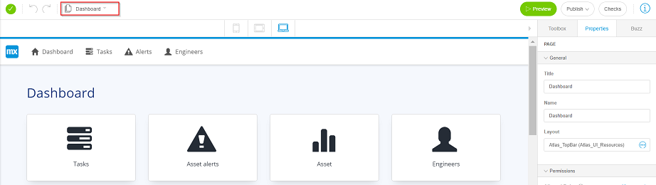
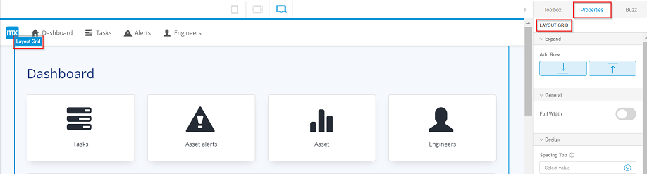

# Add a Row to the Dashboard

To add a row to the dashboard of your app, follow these steps:

1.   Open the Dashboard page of your app. 

    

2.   Select the layout of the dashboard. 

    1.  The **Properties** tab is selected in the top right corner of the Studio.
    2.  Properties of the LAYOUT GRID is available.
    

3.   In the **Expand** menu, click: 
    -   : to add a row at the top of the layout grid.
    -   : to add a row at the bottom of the layout grid.

